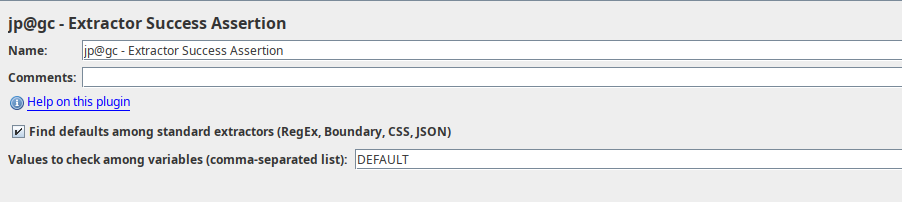

# Extractor Success Assertion for Apache JMeter

A JMeter plugin to check that extractor was successfull. Helps in developing, debugging and troubleshooting JMeter scripts.

The recommended usage is to add single assertion component on very top of Test Plan. Keep it enabled when developing the script, disable it when running production tests.  

The plugin takes variable name and default value from known extractor types, then checks that actual variable value not equals to default, which is assumed to be extractor failure.

There is a text field to specify comma-separated list of custom values (for example, if you use JSR223 to set the variable value).

Upon triggering, the sample would become failed with corresponding assertion subresult:

That's it!

[Support Forum](https://jmeter-plugins.org/support/)